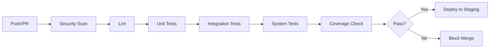

# Testing Strategy - Phase 7: Testing and Quality

## Overview

This document outlines the comprehensive testing strategy for the A2D2 platform, implementing Phase 7 of the development plan.

## Testing Goals

- Achieve **>80% overall test coverage**
- Achieve **>90% coverage** for models and jobs
- Achieve **>85% coverage** for services
- Achieve **>80% coverage** for controllers and helpers
- Ensure all critical and high bugs are fixed before release
- Implement automated testing in CI/CD pipeline

## Test Infrastructure

### Tools and Frameworks

1. **Minitest** - Rails default testing framework
2. **FactoryBot** - Test data generation
3. **SimpleCov** - Code coverage reporting
4. **Capybara** - System/integration testing
5. **Selenium WebDriver** - Browser automation
6. **WebMock** - HTTP request mocking
7. **VCR** - HTTP interaction recording
8. **Shoulda-Matchers** - Additional test matchers
9. **Faker** - Fake data generation

### Configuration

#### SimpleCov Setup

SimpleCov is configured in `test/test_helper.rb` to:
- Track coverage by component (Models, Controllers, Services, Jobs, Helpers)
- Require minimum 80% overall coverage
- Require minimum 70% per-file coverage
- Generate HTML reports in `coverage/` directory

#### FactoryBot Setup

Factories are organized in `test/factories/` directory:
- One file per model
- Traits for common variations
- Associations properly defined
- Realistic test data using Faker

## Test Organization

### Directory Structure

```
test/
├── controllers/        # Controller tests
├── factories/          # FactoryBot factories
├── fixtures/           # Test fixtures (if needed)
├── helpers/            # Helper tests
├── integration/        # Integration tests
├── jobs/               # Background job tests
├── models/             # Model tests
├── services/           # Service tests
├── system/             # System/E2E tests
├── application_system_test_case.rb
└── test_helper.rb
```

## Testing Levels

### 1. Unit Tests

#### Models (Target: >90% coverage)

**Completed Tests:**
- ✅ Cell - value parsing, formula evaluation, validations
- ✅ Task - status transitions, calculations, scopes
- ✅ Report - generation, scheduling, status management
- ✅ Collaborator - permissions, validations, scopes
- ✅ TelemetryData - location tracking, distance calculations, aggregations
- ✅ ProcessExecution - execution flow, progress tracking, error handling

**Remaining Models to Test:**
- agents/reporter_agent.rb
- agents/validator_agent.rb
- agents/transformer_agent.rb
- agents/integration_agent.rb
- dashboard.rb
- inspection_report.rb
- integration_log.rb
- llm_usage_summary.rb
- maintenance_record.rb
- process_step.rb

**What to Test in Models:**
- Validations (presence, uniqueness, format, custom)
- Associations (belongs_to, has_many, has_one, through)
- Callbacks (before_save, after_create, etc.)
- Scopes and class methods
- Instance methods and business logic
- Enums and state machines
- Edge cases and error handling

#### Services (Target: >85% coverage)

**Completed Tests:**
- ✅ Llm::Client - provider routing, fallback chains, rate limiting
- ✅ ProcessBuilderService - step management, validation, reordering

**Remaining Services to Test:**
- analytics/insights_generator.rb
- document_ocr_service.rb
- llm/anthropic_adapter.rb
- llm/base_adapter.rb
- llm/deepseek_adapter.rb
- llm/gemini_adapter.rb
- llm/grok_adapter.rb
- llm/mistral_adapter.rb
- llm/openai_adapter.rb

**What to Test in Services:**
- Input validation
- Business logic execution
- Error handling and edge cases
- Integration with external APIs (using mocks/stubs)
- Return values and side effects

#### Jobs (Target: >90% coverage)

**Completed Tests:**
- ✅ DocumentClassificationJob
- ✅ MetricCollectionJob
- ✅ ProcessExecutionJob
- ✅ ScheduledReportJob

**Remaining Jobs to Test:**
- document_data_extraction_job.rb

**What to Test in Jobs:**
- Job enqueuing
- Successful execution
- Error handling
- Queue configuration
- Idempotency (if applicable)

#### Helpers (Target: >80% coverage)

**Remaining Helpers to Test:**
- application_helper.rb
- dashboard_helper.rb
- home_helper.rb

**What to Test in Helpers:**
- View helper methods
- Formatting functions
- Conditional logic
- Edge cases

### 2. Integration Tests

#### Controllers (Target: >80% coverage)

**Completed Tests:**
- ✅ DashboardController (partially)
- ✅ HomeController (partially)
- ✅ SpreadsheetsController (partially)

**Remaining Controllers to Test:**
- cells_controller.rb
- components_controller.rb
- registrations_controller.rb
- sessions_controller.rb
- sheets_controller.rb
- theme_generator_controller.rb

**What to Test in Controllers:**
- HTTP request/response handling
- Authentication/authorization
- Parameter handling
- Redirects and renders
- Flash messages
- Session management
- JSON API responses (if applicable)

#### API Endpoints

**GraphQL API Testing:**
- Query resolution
- Mutation execution
- Input validation
- Error handling
- Authentication/authorization
- Rate limiting

**REST API Testing (if applicable):**
- CRUD operations
- Request/response formats
- Status codes
- Error responses
- Pagination
- Filtering and sorting

### 3. System Tests (End-to-End)

**Key User Scenarios to Test:**

1. **User Registration and Authentication**
   - Sign up flow
   - Login/logout
   - Password reset
   - Session management

2. **Spreadsheet Management**
   - Create spreadsheet
   - Add/edit sheets
   - Cell operations
   - Formula evaluation
   - Collaboration

3. **Document Processing**
   - Upload document
   - Classification
   - Data extraction
   - OCR processing (if available)

4. **Process Automation**
   - Create process
   - Add/configure steps
   - Execute process
   - Monitor progress
   - Handle errors

5. **Robot Management**
   - Register robot
   - Create tasks
   - Track telemetry
   - Generate reports
   - Maintenance records

6. **Analytics and Reporting**
   - View dashboards
   - Create custom reports
   - Schedule reports
   - Export data

**Browser Compatibility:**
- Chrome/Chromium
- Firefox
- Safari (if possible)
- Edge

**Mobile Responsiveness:**
- Test on different screen sizes
- Touch interactions
- Mobile-specific features

**Accessibility Testing:**
- WCAG 2.1 AA compliance
- Keyboard navigation
- Screen reader compatibility
- Color contrast
- Focus management

## 4. Performance Testing

### Load Testing (Target: 100 concurrent users)

**Tools:**
- k6 or Apache JMeter

**Scenarios:**
- Concurrent user logins
- Simultaneous spreadsheet operations
- Bulk document processing
- Multiple agent tasks
- API endpoint stress testing

**Metrics to Track:**
- Response time (95th percentile < 2s)
- Throughput (requests/second)
- Error rate
- Database query time
- Memory usage
- CPU usage

### Stress Testing

- Identify breaking points
- Test system recovery
- Monitor resource exhaustion

### Endurance Testing

- Run for 24+ hours
- Monitor for memory leaks
- Check database connection pooling
- Verify cache effectiveness

### Query Optimization

**Tools:**
- `bullet` gem for N+1 detection
- `rack-mini-profiler` for request profiling
- Database EXPLAIN for query analysis

**Focus Areas:**
- Identify slow queries (>500ms)
- Add missing indexes
- Optimize N+1 queries
- Implement eager loading
- Add appropriate caching

## 5. Security Testing

### Static Analysis

**Brakeman** - Rails security scanner
```bash
bin/brakeman --no-pager
```

**bundler-audit** - Dependency vulnerability scanner
```bash
bin/bundler-audit
```

### Dynamic Analysis

**OWASP ZAP** - Web application security scanner

**Manual Testing:**
- SQL injection attempts
- XSS (Cross-Site Scripting) attacks
- CSRF token validation
- Authentication bypass attempts
- Authorization checks
- Session hijacking
- File upload vulnerabilities

### Security Checklist

- ✅ Brakeman scan with 0 high/critical issues
- ✅ bundler-audit with 0 known vulnerabilities
- ✅ Strong password requirements
- ✅ Rate limiting on authentication
- ✅ CSRF protection enabled
- ✅ SQL injection protection (parameterized queries)
- ✅ XSS protection (proper escaping)
- ✅ Secure session management
- ✅ HTTPS enforcement
- ✅ Security headers (CSP, X-Frame-Options, etc.)

## Running Tests

### All Tests

```bash
bin/rails test
```

### Specific Test Types

```bash
# Models only
bin/rails test:models

# Controllers only
bin/rails test:controllers

# System tests
bin/rails test:system

# Specific file
bin/rails test test/models/user_test.rb

# Specific test
bin/rails test test/models/user_test.rb:15
```

### With Coverage

```bash
COVERAGE=true bin/rails test
```

View coverage report at `coverage/index.html`

### Parallel Testing

Rails 6+ supports parallel testing:

```bash
bin/rails test -j 4  # Run with 4 workers
```

## CI/CD Integration

### GitHub Actions Workflow

The CI pipeline (`.github/workflows/ci.yml`) runs:

1. **Security Scans**
   - Brakeman (Rails vulnerabilities)
   - bundler-audit (Gem vulnerabilities)
   - importmap audit (JS dependencies)

2. **Linting**
   - RuboCop (code style)

3. **Tests**
   - Unit tests
   - Integration tests
   - System tests

4. **Coverage Reports**
   - SimpleCov generates reports
   - Fail if coverage below threshold

### Test Workflow



## Test Data Management

### Factories

- Use FactoryBot for creating test data
- Keep factories DRY and maintainable
- Use traits for variations
- Avoid unnecessary database hits

### Fixtures

- Minimize use of fixtures
- Prefer factories for flexibility
- Use fixtures only for static reference data

### Test Database

- Use separate test database
- Reset database between tests
- Use transactions for test isolation
- Seed minimal required data

## Coverage Targets

### Overall Target: >80%

| Component | Target | Current | Status |
|-----------|--------|---------|--------|
| Models | >90% | TBD | 🟡 In Progress |
| Services | >85% | TBD | 🟡 In Progress |
| Controllers | >80% | TBD | 🟡 In Progress |
| Jobs | >90% | TBD | 🟡 In Progress |
| Helpers | >80% | TBD | 🟡 In Progress |
| **Overall** | **>80%** | **TBD** | **🟡 In Progress** |

## Quality Metrics

### Code Quality

- RuboCop offenses: 0
- Brakeman issues: 0 high/critical
- Test failures: 0
- Code smells: Minimal

### Performance Metrics

- Response time: <2s (95th percentile)
- Database query time: <500ms
- Page load time: <1s
- API response: <500ms
- Concurrent users: 100+

## Testing Best Practices

### General Guidelines

1. **Keep tests independent** - No test should depend on another
2. **One assertion per test** - Focus on single behavior
3. **Use descriptive names** - Test name should describe what is tested
4. **Follow AAA pattern** - Arrange, Act, Assert
5. **Test edge cases** - Not just happy path
6. **Mock external dependencies** - Use WebMock/VCR for HTTP calls
7. **Keep tests fast** - Avoid unnecessary database queries
8. **Test behavior, not implementation** - Focus on outcomes

### Model Testing

```ruby
test "should require name" do
  user = build(:user, name: nil)
  assert_not user.valid?
  assert_includes user.errors[:name], "can't be blank"
end
```

### Controller Testing

```ruby
test "should get index" do
  get users_url
  assert_response :success
end
```

### Service Testing

```ruby
test "should process data successfully" do
  service = DataProcessor.new(data)
  result = service.process
  assert result.success?
  assert_not_nil result.output
end
```

### Job Testing

```ruby
test "should enqueue job" do
  assert_enqueued_with(job: MyJob, args: [1]) do
    MyJob.perform_later(1)
  end
end
```

## Maintenance and Updates

### Regular Tasks

- Review and update tests with code changes
- Maintain test coverage above thresholds
- Update factories when models change
- Review and fix flaky tests
- Update test documentation
- Monitor test performance

### Quarterly Reviews

- Analyze coverage trends
- Identify untested code paths
- Review and refactor slow tests
- Update testing tools and gems
- Review security test results

## Resources

### Documentation

- [Rails Testing Guide](https://guides.rubyonrails.org/testing.html)
- [Minitest Documentation](https://github.com/minitest/minitest)
- [FactoryBot Documentation](https://github.com/thoughtbot/factory_bot)
- [SimpleCov Documentation](https://github.com/simplecov-ruby/simplecov)
- [Capybara Documentation](https://github.com/teamcapybara/capybara)

### Tools

- [Brakeman](https://brakemanscanner.org/)
- [bundler-audit](https://github.com/rubysec/bundler-audit)
- [RuboCop](https://rubocop.org/)
- [OWASP ZAP](https://www.zaproxy.org/)

## Conclusion

This testing strategy provides a comprehensive framework for ensuring the quality and reliability of the A2D2 platform. Following these guidelines will help achieve the Phase 7 objectives and deliver a robust, well-tested application.

## Status Updates

- **2025-10-28**: Initial testing infrastructure setup completed
  - SimpleCov configuration added
  - FactoryBot setup completed
  - Test gems added to Gemfile
  - Core model tests created
  - Job tests created
  - Service tests initiated
  - Documentation created
