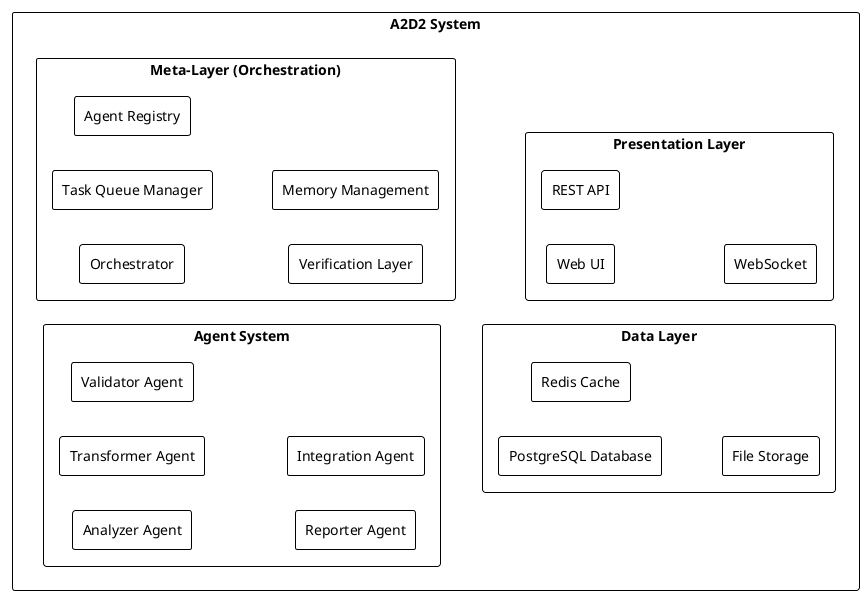
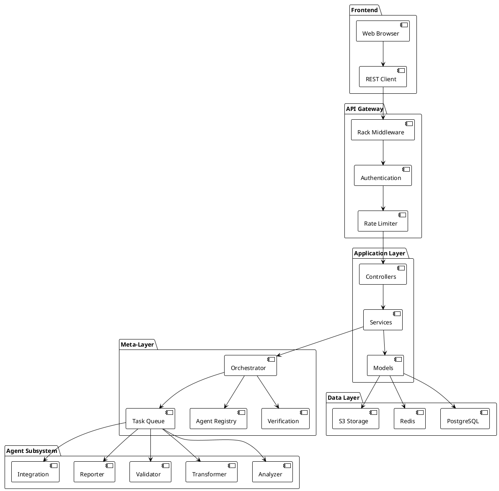
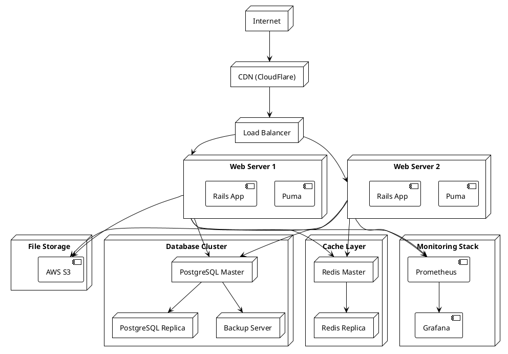
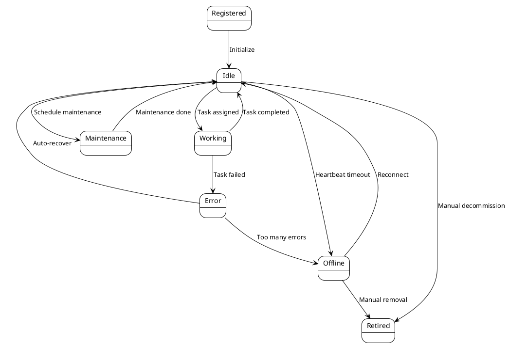
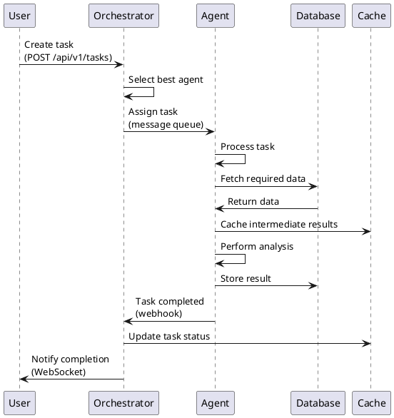
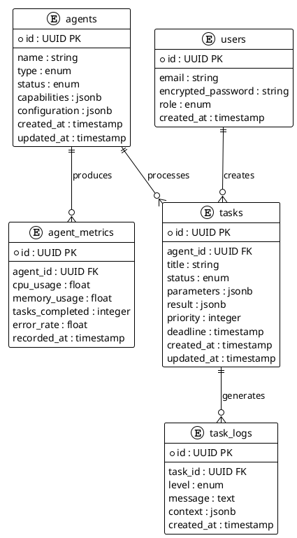
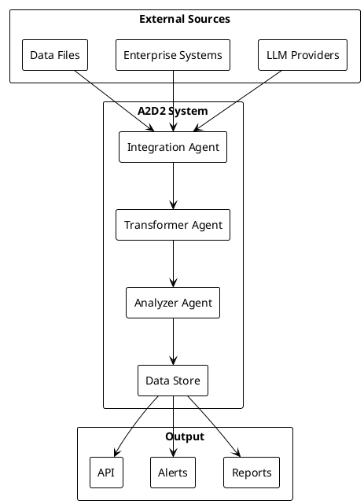
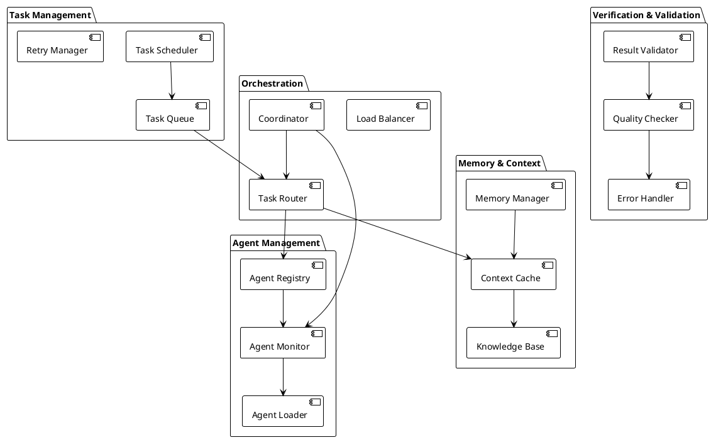
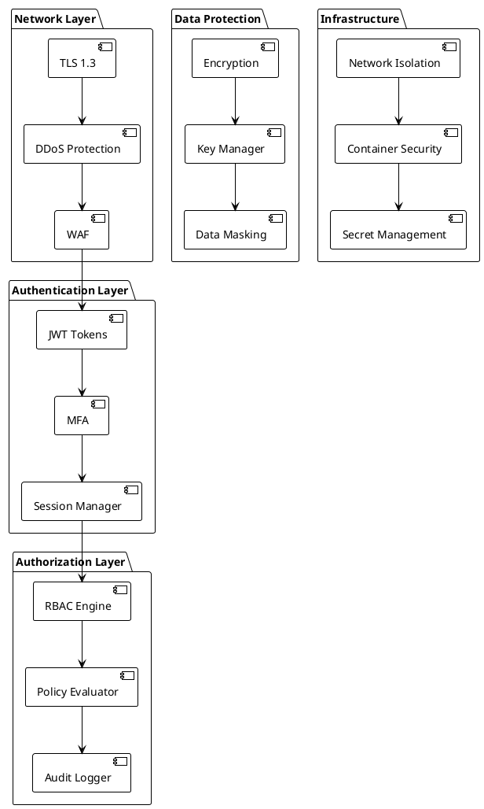
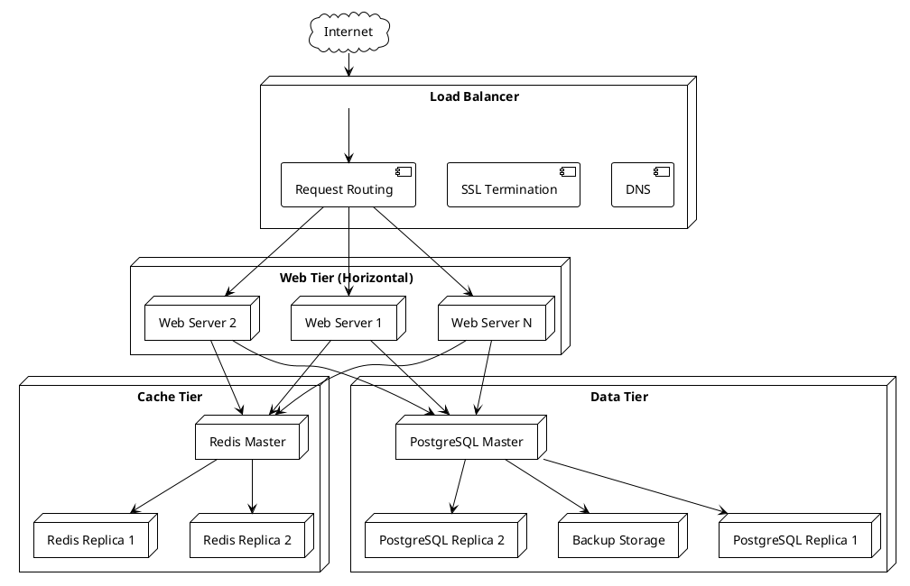

# Архитектурные диаграммы системы A2D2

**Версия**: 1.0
**Дата**: 28 октября 2025
**Формат**: PlantUML

---

## 1. System Context Diagram (Контекстная диаграмма системы)

```plantuml
@startuml System Context Diagram
!theme plain
left to right direction

actor "End Users" as users
actor "Administrators" as admins
actor "External Systems" as external

rectangle "A2D2 Platform" as a2d2 #LightBlue

users -->|Web UI| a2d2
admins -->|Admin UI| a2d2
a2d2 -->|REST API| external
external -->|Data Integration| a2d2

note on link
  - Dashboard
  - Agent Management
  - Task Monitoring
end note

@enduml
```

---

## 2. Functional Decomposition (Диаграмма декомпозиции функций)



---

## 3. Component Architecture (Диаграмма компонентов)



---

## 4. Deployment Diagram (Диаграмма развертывания)



---

## 5. Agent Lifecycle (Диаграмма состояний агента)



---

## 6. Task Processing Flow (Диаграмма потока обработки задачи)

```plantuml
@startuml Task Processing Flow
!theme plain

start

:User creates task;

:Task enters Queue;

:Orchestrator selects Agent
  based on:
  - Capabilities match
  - Current load
  - Priority;

:Task assigned to Agent;

:Agent processes task;

decision "Task successful?"
  case yes
    :Store result;
    :Verification passes;
  case no
    :Log error;
    decision "Retry?"
      case yes
        :Re-queue task;
      case no
        :Mark as failed;
    endcase
endcase

:Notify user;

end

@enduml
```

---

## 7. Agent Communication Protocol (Диаграмма последовательности взаимодействия)



---

## 8. Database Schema (ER диаграмма)



---

## 9. System Information Flow (Информационные потоки)



---

## 10. Detailed Architecture - Meta-Layer



---

## 11. Security Layers



---

## 12. Scaling Architecture



---

**Диаграммы созданы в формате PlantUML**

Для просмотра и рендеринга диаграмм используйте:
- [PlantUML Online Editor](http://www.plantuml.com/plantuml/uml/)
- VS Code Extension: PlantUML
- GitHub Markdown (автоматический рендеринг)

**Статус**: 🟢 Утверждено
