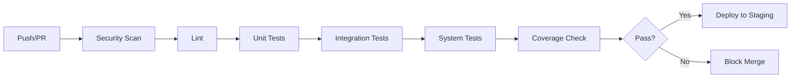

# Стратегия тестирования - Фаза 7: Тестирование и качество

## Обзор

Этот документ описывает комплексную стратегию тестирования платформы A2D2, реализующую фазу 7 плана разработки.

## Цели тестирования

- Достичь **>80% общего покрытия тестами**
- Достичь **>90% покрытия** для моделей и задач
- Достичь **>85% покрытия** для сервисов
- Достичь **>80% покрытия** для контроллеров и helpers
- Исправить все критические и высокие баги перед релизом
- Внедрить автоматизированное тестирование в конвейере CI/CD

## Инфраструктура тестирования

### Инструменты и фреймворки

1. **Minitest** - Стандартный фреймворк тестирования Rails
2. **FactoryBot** - Генерация тестовых данных
3. **SimpleCov** - Отчеты о покрытии кода
4. **Capybara** - Системное/интеграционное тестирование
5. **Selenium WebDriver** - Автоматизация браузера
6. **WebMock** - Мок HTTP запросов
7. **VCR** - Запись HTTP взаимодействий
8. **Shoulda-Matchers** - Дополнительные матчеры для тестов
9. **Faker** - Генерация фейковых данных

### Конфигурация

#### Настройка SimpleCov

SimpleCov настроен в `test/test_helper.rb` для:
- Отслеживания покрытия по компонентам (Models, Controllers, Services, Jobs, Helpers)
- Требования минимум 80% общего покрытия
- Требования минимум 70% покрытия на файл
- Генерации HTML отчетов в директории `coverage/`

#### Настройка FactoryBot

Фабрики организованы в директории `test/factories/`:
- Один файл на модель
- Traits для общих вариаций
- Правильно определенные ассоциации
- Реалистичные тестовые данные с использованием Faker

## Организация тестов

### Структура директорий

```
test/
├── controllers/        # Тесты контроллеров
├── factories/          # Фабрики FactoryBot
├── fixtures/           # Тестовые фикстуры (если нужны)
├── helpers/            # Тесты helpers
├── integration/        # Интеграционные тесты
├── jobs/               # Тесты фоновых задач
├── models/             # Тесты моделей
├── services/           # Тесты сервисов
├── system/             # Системные/E2E тесты
├── application_system_test_case.rb
└── test_helper.rb
```

## Уровни тестирования

### 1. Модульные тесты

#### Модели (Цель: >90% покрытие)

**Завершенные тесты:**
- ✅ Cell - парсинг значений, вычисление формул, валидации
- ✅ Task - переходы статусов, вычисления, scopes
- ✅ Report - генерация, планирование, управление статусом
- ✅ Collaborator - права доступа, валидации, scopes
- ✅ TelemetryData - отслеживание местоположения, вычисление расстояний, агрегации
- ✅ ProcessExecution - поток выполнения, отслеживание прогресса, обработка ошибок

**Оставшиеся модели для тестирования:**
- agents/reporter_agent.rb
- agents/validator_agent.rb
- agents/transformer_agent.rb
- agents/integration_agent.rb
- dashboard.rb
- inspection_report.rb
- integration_log.rb
- llm_usage_summary.rb
- maintenance_record.rb
- process_step.rb

**Что тестировать в моделях:**
- Валидации (presence, uniqueness, format, custom)
- Ассоциации (belongs_to, has_many, has_one, through)
- Callbacks (before_save, after_create, etc.)
- Scopes и методы класса
- Методы экземпляра и бизнес-логика
- Enums и state machines
- Граничные случаи и обработка ошибок

#### Сервисы (Цель: >85% покрытие)

**Завершенные тесты:**
- ✅ Llm::Client - маршрутизация провайдера, цепочки отката, ограничение скорости
- ✅ ProcessBuilderService - управление шагами, валидация, переупорядочивание

**Оставшиеся сервисы для тестирования:**
- analytics/insights_generator.rb
- document_ocr_service.rb
- llm/anthropic_adapter.rb
- llm/base_adapter.rb
- llm/deepseek_adapter.rb
- llm/gemini_adapter.rb
- llm/grok_adapter.rb
- llm/mistral_adapter.rb
- llm/openai_adapter.rb

**Что тестировать в сервисах:**
- Валидация входных данных
- Выполнение бизнес-логики
- Обработка ошибок и граничные случаи
- Интеграция с внешними API (используя mocks/stubs)
- Возвращаемые значения и побочные эффекты

#### Задачи (Цель: >90% покрытие)

**Завершенные тесты:**
- ✅ DocumentClassificationJob
- ✅ MetricCollectionJob
- ✅ ProcessExecutionJob
- ✅ ScheduledReportJob

**Оставшиеся задачи для тестирования:**
- document_data_extraction_job.rb

**Что тестировать в задачах:**
- Постановка задачи в очередь
- Успешное выполнение
- Обработка ошибок
- Конфигурация очереди
- Идемпотентность (если применимо)

#### Helpers (Цель: >80% покрытие)

**Оставшиеся helpers для тестирования:**
- application_helper.rb
- dashboard_helper.rb
- home_helper.rb

**Что тестировать в helpers:**
- Методы-помощники представлений
- Функции форматирования
- Условная логика
- Граничные случаи

### 2. Интеграционные тесты

#### Контроллеры (Цель: >80% покрытие)

**Завершенные тесты:**
- ✅ DashboardController (частично)
- ✅ HomeController (частично)
- ✅ SpreadsheetsController (частично)

**Оставшиеся контроллеры для тестирования:**
- cells_controller.rb
- components_controller.rb
- registrations_controller.rb
- sessions_controller.rb
- sheets_controller.rb
- theme_generator_controller.rb

**Что тестировать в контроллерах:**
- Обработка HTTP запросов/ответов
- Аутентификация/авторизация
- Обработка параметров
- Редиректы и рендеры
- Flash сообщения
- Управление сессиями
- JSON API ответы (если применимо)

#### API Endpoints

**Тестирование GraphQL API:**
- Разрешение запросов
- Выполнение мутаций
- Валидация входных данных
- Обработка ошибок
- Аутентификация/авторизация
- Ограничение скорости

**Тестирование REST API (если применимо):**
- CRUD операции
- Форматы запросов/ответов
- Коды статуса
- Ответы с ошибками
- Пагинация
- Фильтрация и сортировка

### 3. Системные тесты (End-to-End)

**Ключевые пользовательские сценарии для тестирования:**

1. **Регистрация и аутентификация пользователя**
   - Поток регистрации
   - Вход/выход
   - Сброс пароля
   - Управление сессиями

2. **Управление таблицами**
   - Создание таблицы
   - Добавление/редактирование листов
   - Операции с ячейками
   - Вычисление формул
   - Совместная работа

3. **Обработка документов**
   - Загрузка документа
   - Классификация
   - Извлечение данных
   - OCR обработка (если доступна)

4. **Автоматизация процессов**
   - Создание процесса
   - Добавление/настройка шагов
   - Выполнение процесса
   - Мониторинг прогресса
   - Обработка ошибок

5. **Управление роботами**
   - Регистрация робота
   - Создание задач
   - Отслеживание телеметрии
   - Генерация отчетов
   - Записи о техобслуживании

6. **Аналитика и отчетность**
   - Просмотр дашбордов
   - Создание пользовательских отчетов
   - Планирование отчетов
   - Экспорт данных

**Совместимость с браузерами:**
- Chrome/Chromium
- Firefox
- Safari (если возможно)
- Edge

**Мобильная отзывчивость:**
- Тестирование на разных размерах экрана
- Сенсорные взаимодействия
- Специфичные для мобильных функции

**Тестирование доступности:**
- Соответствие WCAG 2.1 AA
- Навигация с клавиатуры
- Совместимость с экранным диктором
- Контраст цветов
- Управление фокусом

## 4. Тестирование производительности

### Нагрузочное тестирование (Цель: 100 одновременных пользователей)

**Инструменты:**
- k6 или Apache JMeter

**Сценарии:**
- Одновременный вход пользователей
- Одновременные операции с таблицами
- Массовая обработка документов
- Множественные задачи агентов
- Стресс-тестирование API endpoints

**Метрики для отслеживания:**
- Время отклика (95-й процентиль < 2с)
- Пропускная способность (запросов/секунду)
- Частота ошибок
- Время запроса к БД
- Использование памяти
- Использование CPU

### Стресс-тестирование

- Определение точек разрушения
- Тестирование восстановления системы
- Мониторинг исчерпания ресурсов

### Тестирование на выносливость

- Работа в течение 24+ часов
- Мониторинг утечек памяти
- Проверка пулинга соединений с БД
- Проверка эффективности кеша

### Оптимизация запросов

**Инструменты:**
- Gem `bullet` для обнаружения N+1
- `rack-mini-profiler` для профилирования запросов
- Database EXPLAIN для анализа запросов

**Области фокуса:**
- Определение медленных запросов (>500мс)
- Добавление отсутствующих индексов
- Оптимизация N+1 запросов
- Реализация eager loading
- Добавление соответствующего кеширования

## 5. Тестирование безопасности

### Статический анализ

**Brakeman** - Сканер безопасности Rails
```bash
bin/brakeman --no-pager
```

**bundler-audit** - Сканер уязвимостей зависимостей
```bash
bin/bundler-audit
```

### Динамический анализ

**OWASP ZAP** - Сканер безопасности веб-приложений

**Ручное тестирование:**
- Попытки SQL injection
- XSS (Cross-Site Scripting) атаки
- Валидация CSRF токена
- Попытки обхода аутентификации
- Проверки авторизации
- Перехват сессии
- Уязвимости загрузки файлов

### Чек-лист безопасности

- ✅ Сканирование Brakeman с 0 высоких/критических проблем
- ✅ bundler-audit с 0 известными уязвимостями
- ✅ Требования к надежному паролю
- ✅ Ограничение скорости при аутентификации
- ✅ Защита CSRF включена
- ✅ Защита от SQL injection (параметризованные запросы)
- ✅ Защита от XSS (правильное экранирование)
- ✅ Безопасное управление сессиями
- ✅ Принудительное использование HTTPS
- ✅ Заголовки безопасности (CSP, X-Frame-Options, и т.д.)

## Запуск тестов

### Все тесты

```bash
bin/rails test
```

### Специфические типы тестов

```bash
# Только модели
bin/rails test:models

# Только контроллеры
bin/rails test:controllers

# Системные тесты
bin/rails test:system

# Конкретный файл
bin/rails test test/models/user_test.rb

# Конкретный тест
bin/rails test test/models/user_test.rb:15
```

### С покрытием

```bash
COVERAGE=true bin/rails test
```

Просмотр отчета о покрытии в `coverage/index.html`

### Параллельное тестирование

Rails 6+ поддерживает параллельное тестирование:

```bash
bin/rails test -j 4  # Запуск с 4 рабочими процессами
```

## Интеграция с CI/CD

### Рабочий процесс GitHub Actions

Конвейер CI (`.github/workflows/ci.yml`) выполняет:

1. **Сканирование безопасности**
   - Brakeman (уязвимости Rails)
   - bundler-audit (уязвимости Gem)
   - importmap audit (JS зависимости)

2. **Линтинг**
   - RuboCop (стиль кода)

3. **Тесты**
   - Модульные тесты
   - Интеграционные тесты
   - Системные тесты

4. **Отчеты о покрытии**
   - SimpleCov генерирует отчеты
   - Сбой при покрытии ниже порога

### Рабочий процесс тестирования



## Управление тестовыми данными

### Фабрики

- Использовать FactoryBot для создания тестовых данных
- Поддерживать фабрики DRY и обслуживаемыми
- Использовать traits для вариаций
- Избегать ненужных обращений к БД

### Фикстуры

- Минимизировать использование фикстур
- Предпочитать фабрики для гибкости
- Использовать фикстуры только для статических справочных данных

### Тестовая база данных

- Использовать отдельную тестовую БД
- Сбрасывать БД между тестами
- Использовать транзакции для изоляции тестов
- Заполнять минимально необходимыми данными

## Целевые показатели покрытия

### Общая цель: >80%

| Компонент | Цель | Текущее | Статус |
|-----------|------|---------|--------|
| Модели | >90% | TBD | 🟡 В процессе |
| Сервисы | >85% | TBD | 🟡 В процессе |
| Контроллеры | >80% | TBD | 🟡 В процессе |
| Задачи | >90% | TBD | 🟡 В процессе |
| Helpers | >80% | TBD | 🟡 В процессе |
| **Всего** | **>80%** | **TBD** | **🟡 В процессе** |

## Метрики качества

### Качество кода

- Нарушения RuboCop: 0
- Проблемы Brakeman: 0 высоких/критических
- Сбои тестов: 0
- Код-смеллы: Минимальные

### Метрики производительности

- Время отклика: <2с (95-й процентиль)
- Время запроса к БД: <500мс
- Время загрузки страницы: <1с
- Ответ API: <500мс
- Одновременные пользователи: 100+

## Лучшие практики тестирования

### Общие рекомендации

1. **Держите тесты независимыми** - Ни один тест не должен зависеть от другого
2. **Одна проверка на тест** - Фокус на одном поведении
3. **Используйте описательные имена** - Имя теста должно описывать что тестируется
4. **Следуйте паттерну AAA** - Arrange, Act, Assert
5. **Тестируйте граничные случаи** - Не только успешный путь
6. **Мокируйте внешние зависимости** - Используйте WebMock/VCR для HTTP вызовов
7. **Держите тесты быстрыми** - Избегайте ненужных запросов к БД
8. **Тестируйте поведение, не реализацию** - Фокус на результатах

### Тестирование моделей

```ruby
test "should require name" do
  user = build(:user, name: nil)
  assert_not user.valid?
  assert_includes user.errors[:name], "can't be blank"
end
```

### Тестирование контроллеров

```ruby
test "should get index" do
  get users_url
  assert_response :success
end
```

### Тестирование сервисов

```ruby
test "should process data successfully" do
  service = DataProcessor.new(data)
  result = service.process
  assert result.success?
  assert_not_nil result.output
end
```

### Тестирование задач

```ruby
test "should enqueue job" do
  assert_enqueued_with(job: MyJob, args: [1]) do
    MyJob.perform_later(1)
  end
end
```

## Обслуживание и обновления

### Регулярные задачи

- Проверять и обновлять тесты при изменении кода
- Поддерживать покрытие тестами выше порогов
- Обновлять фабрики при изменении моделей
- Проверять и исправлять нестабильные тесты
- Обновлять документацию по тестам
- Мониторить производительность тестов

### Квартальные проверки

- Анализировать тренды покрытия
- Определять непротестированные пути кода
- Проверять и рефакторить медленные тесты
- Обновлять инструменты и gems для тестирования
- Проверять результаты тестов безопасности

## Ресурсы

### Документация

- [Rails Testing Guide](https://guides.rubyonrails.org/testing.html)
- [Minitest Documentation](https://github.com/minitest/minitest)
- [FactoryBot Documentation](https://github.com/thoughtbot/factory_bot)
- [SimpleCov Documentation](https://github.com/simplecov-ruby/simplecov)
- [Capybara Documentation](https://github.com/teamcapybara/capybara)

### Инструменты

- [Brakeman](https://brakemanscanner.org/)
- [bundler-audit](https://github.com/rubysec/bundler-audit)
- [RuboCop](https://rubocop.org/)
- [OWASP ZAP](https://www.zaproxy.org/)

## Заключение

Эта стратегия тестирования обеспечивает комплексную основу для обеспечения качества и надежности платформы A2D2. Следование этим рекомендациям поможет достичь целей фазы 7 и предоставить надежное, хорошо протестированное приложение.

## Обновления статуса

- **2025-10-28**: Завершена начальная настройка инфраструктуры тестирования
  - Добавлена конфигурация SimpleCov
  - Завершена настройка FactoryBot
  - Добавлены тестовые gems в Gemfile
  - Созданы основные тесты моделей
  - Созданы тесты задач
  - Инициированы тесты сервисов
  - Создана документация
